---
# Front matter
lang: ru-RU
title: "Лабораторная работа №1"
subtitle: "Установка и конфигурация операционной системы на виртуальную машину"
author: "Роман Владимирович Иванов"

# Formatting
toc-title: "Содержание"
toc: true # Table of contents
toc_depth: 2
lof: true # List of figures
lot: true # List of tables
fontsize: 12pt
linestretch: 1.5
papersize: a4paper
documentclass: scrreprt
polyglossia-lang: russian
polyglossia-otherlangs: english
mainfont: PT Serif
romanfont: PT Serif
sansfont: PT Sans
monofont: PT Mono
mainfontoptions: Ligatures=TeX
romanfontoptions: Ligatures=TeX
sansfontoptions: Ligatures=TeX,Scale=MatchLowercase
monofontoptions: Scale=MatchLowercase
indent: true
pdf-engine: lualatex
header-includes:
  - \linepenalty=10 # the penalty added to the badness of each line within a paragraph (no associated penalty node) Increasing the value makes tex try to have fewer lines in the paragraph.
  - \interlinepenalty=0 # value of the penalty (node) added after each line of a paragraph.
  - \hyphenpenalty=50 # the penalty for line breaking at an automatically inserted hyphen
  - \exhyphenpenalty=50 # the penalty for line breaking at an explicit hyphen
  - \binoppenalty=700 # the penalty for breaking a line at a binary operator
  - \relpenalty=500 # the penalty for breaking a line at a relation
  - \clubpenalty=150 # extra penalty for breaking after first line of a paragraph
  - \widowpenalty=150 # extra penalty for breaking before last line of a paragraph
  - \displaywidowpenalty=50 # extra penalty for breaking before last line before a display math
  - \brokenpenalty=100 # extra penalty for page breaking after a hyphenated line
  - \predisplaypenalty=10000 # penalty for breaking before a display
  - \postdisplaypenalty=0 # penalty for breaking after a display
  - \floatingpenalty = 20000 # penalty for splitting an insertion (can only be split footnote in standard LaTeX)
  - \raggedbottom # or \flushbottom
  - \usepackage{float} # keep figures where there are in the text
  - \floatplacement{figure}{H} # keep figures where there are in the text
---

# Цель работы

Приобретение практических навыков установки операционной системы на виртуальную машину, настройки минимально необходимых для дальнейшей работы сервисов.

# Задание

1. Проверить настройки VirtualBox. Создать новую вирутальную машину Base.
2. Запустить виртуальную машину Base. Провести ее конфигурацию.
3. Подключиться к вирутальной машине, используя созданную учетную записью.
4. Создать на основе виртуальной машины Base машину Host2.

# Выполнение лабораторной работы

1. Перешел в созданный мною каталог \textit{rvivanov} и перенес в него образ виртуальной машины \textit{CentOS-6.6-i386-bin-DVD1.iso} (рис -@fig:001)

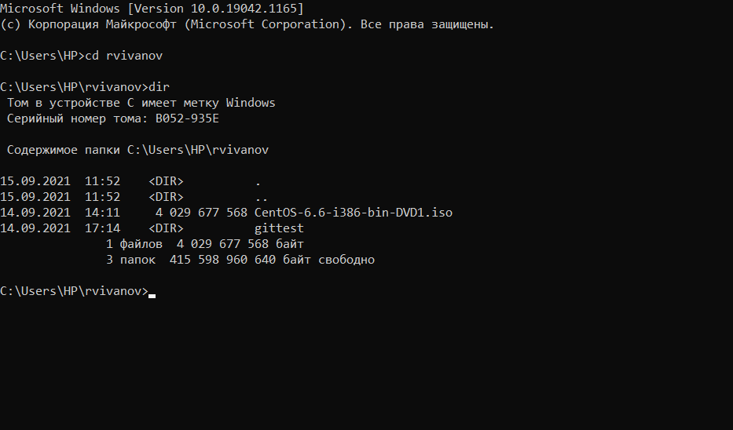{ #fig:001 width=70% }

Запустил виртуальную машину и проверил в свойствах VirtualBox месторасположение каталога для виртуальных машин (рис -@fig:002).

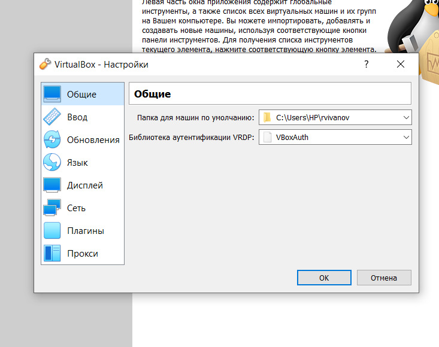{ #fig:002 width=70% }

Создал виртуальную машину, указал ее имя - Base, указал тип операционной системы - Linux, RedHat(32 bit) (рис -@fig:003)

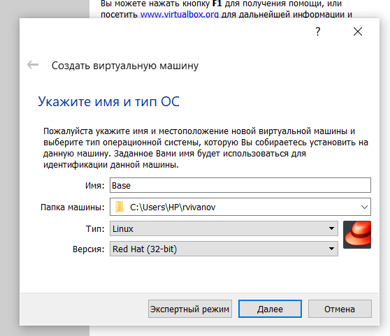{ #fig:003 width=70% }

Указал размер основной памяти виртуальной машины - 1024 МБ (рис -@fig:004)

{ #fig:004 width=70% }

Задал конфигурацию жёсткого диска — загрузочный (рис -@fig:005), VDI (BirtualBox Disk Image) (рис -@fig:006), динамический виртуальный диск (рис -@fig:007).

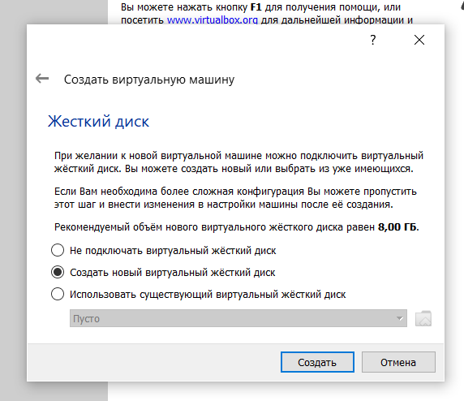{ #fig:005 width=70% }

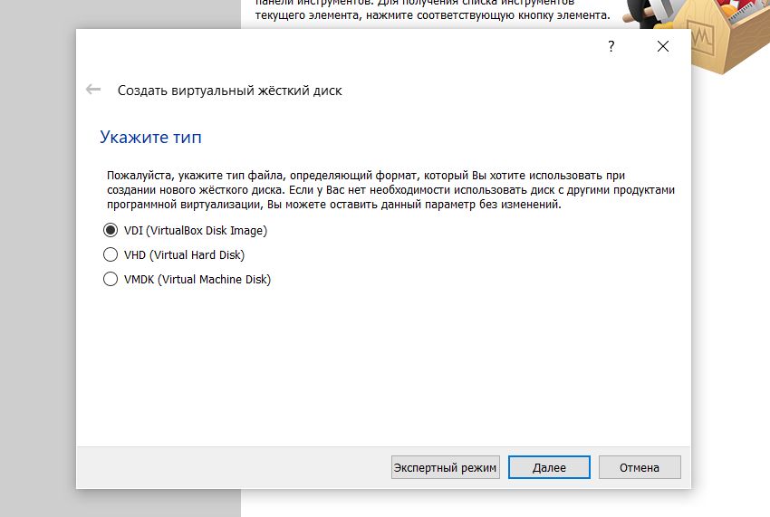{ #fig:006 width=70% }

{ #fig:007 width=70% }

Задал размер диска — 40 ГБ, его расположение — в данном случае «C:\\Users\\HP\\rvivanov\\Base\\Base.vdi» (рис -@fig:008)

{ #fig:008 width=70% }

Выделил в окне менеджера VirtualBox виртуальную машину \textit{Base}, и открыл окно \textit{Настройки}. Проверил, что папка для снимков виртуальной машины Base имеет путь «C:\\Users\\HP\\rvivanov\\Base\\Snapshots» (рис -@fig:009)

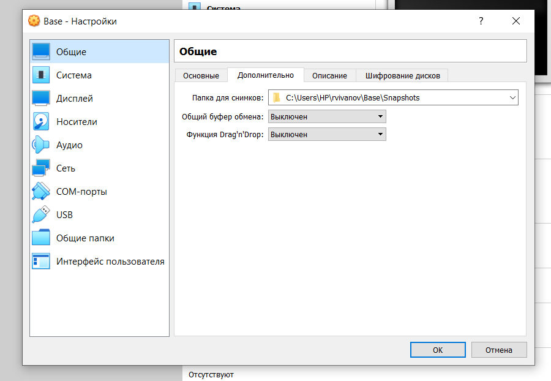{ #fig:009 width=70% }

Добавил новый привод оптических дисков и выбрал образ \textit{CentOS-6.6-i386-bin-DVD1.iso} (рис -@fig:010, рис -@fig:011)

{ #fig:010 width=70% }

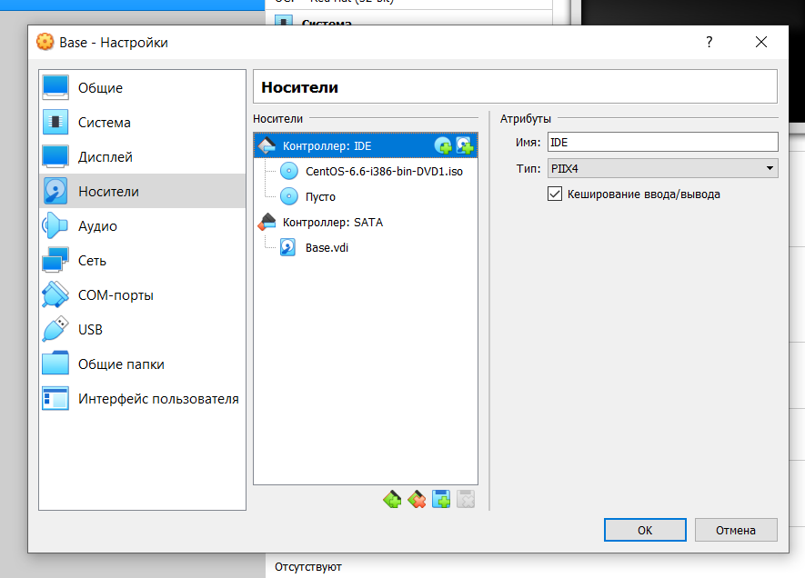{ #fig:011 width=70% }

2. Запустил виртуальную машину Base, выбрал установку системы на жесткий диск (рис -@fig:012, рис -@fig:013)

{ #fig:012 width=70% }

{ #fig:013 width=70% }

Установил русский язык для интерфейса (рис -@fig:014) и раскладки клавиатуры (рис -@fig:015)

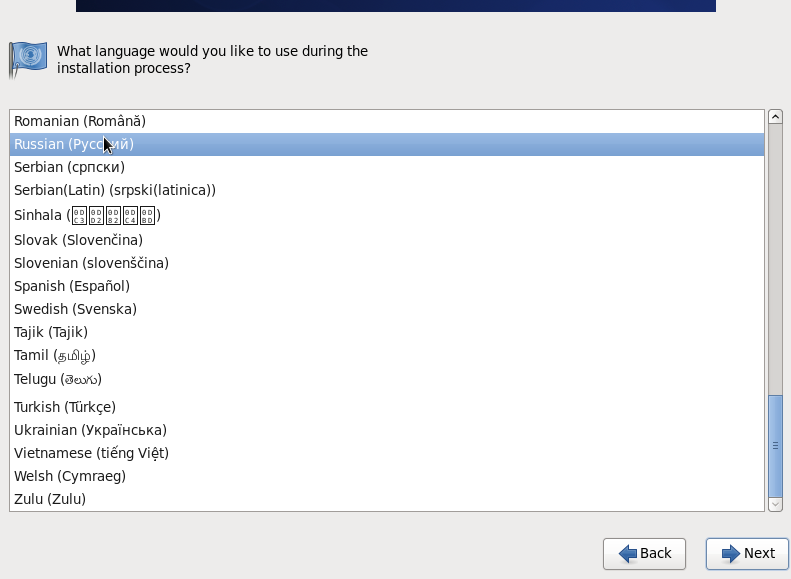{ #fig:014 width=70% }

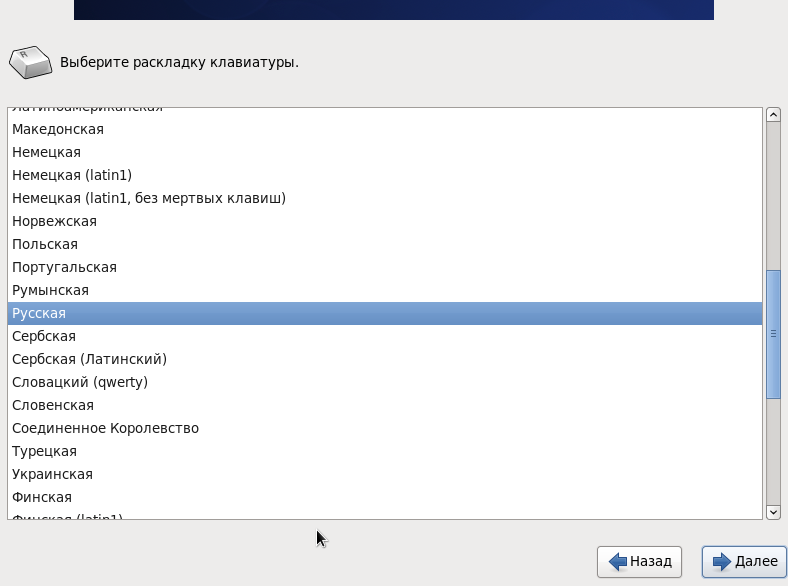{ #fig:015 width=70% }

Указал \textit{Стандартные накопители} (рис -@fig:016) для установки ОС. В окне конфигурации жёсткого диска выбрал \textit{«Да, удалить данные»} (рис -@fig:017)

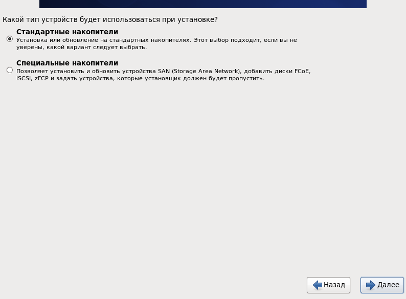{ #fig:016 width=70% }

{ #fig:017 width=70% }

В качестве имени машины указал \textit{«rvivanov.localdomain»} (рис -@fig:018). Указал часовой пояс «Москва» (рис -@fig:019), установил пароль для root (рис -@fig:020).

{ #fig:018 width=70% }

{ #fig:019 width=70% }

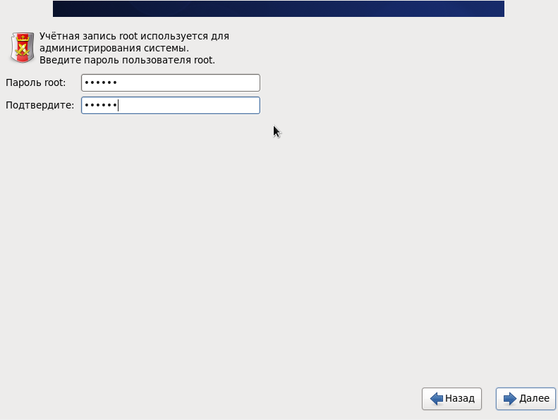{ #fig:020 width=70% }

При конфигурировании размера жёсткого диска указал \textit{«Всё пространство»} (рис -@fig:021).

{ #fig:021 width=70% }

Выбрал вариант стандартной установки CentOS (рис -@fig:022).

{ #fig:022 width=70% }

Завершил установку операционной системы (рис -@fig:023) и перезагрузил её.

{ #fig:023 width=70% }

Запустил виртуальную машину Base и настроил её (рис -@fig:024, рис -@fig:025, рис -@fig:026, рис -@fig:027).

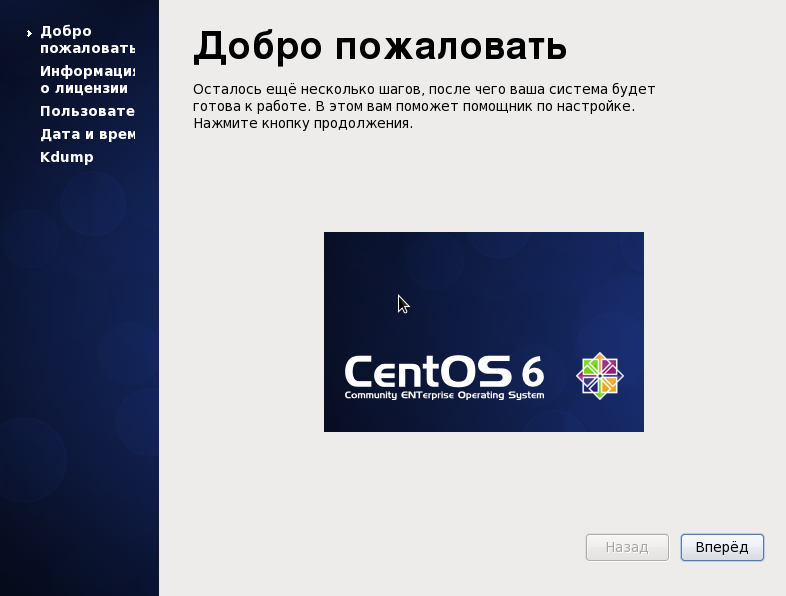{ #fig:024 width=70% }

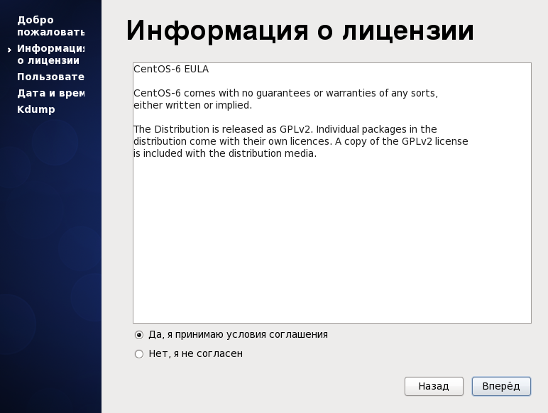{ #fig:025 width=70% }

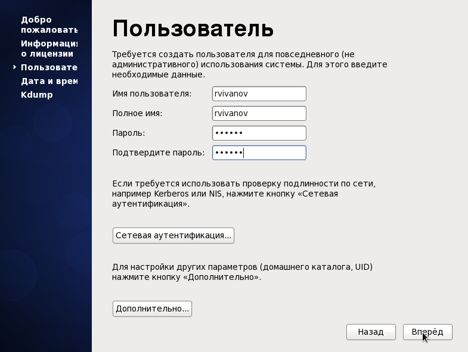{ #fig:026 width=70% }

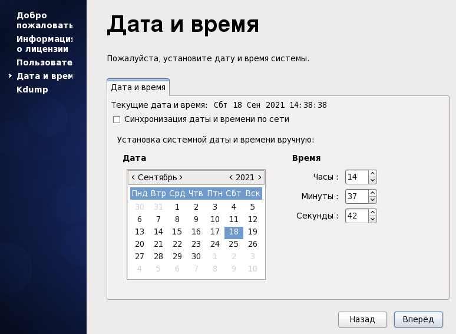{ #fig:027 width=70% }

3. Подключился к виртуальной машине с помощью созданной учётной записи (рис -@fig:028)

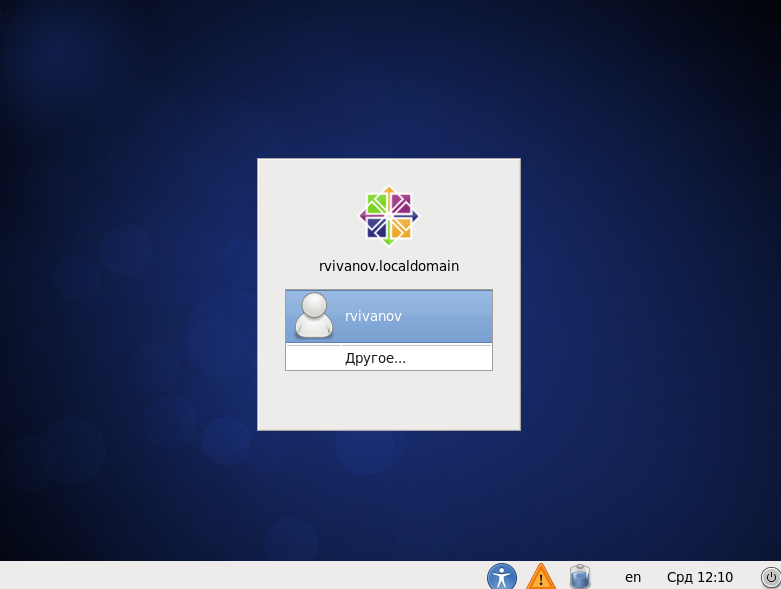{ #fig:028 width=70% }

На виртуальной машине Base запустил терминал, перешел под учетную запись \textit{root} с помощью команды \textit{su} (рис -@fig:029).

{ #fig:029 width=70% }

С помощью команды \textit{yum update} обновил системные файлы и установил \textit{mc} (рис -@fig:030).

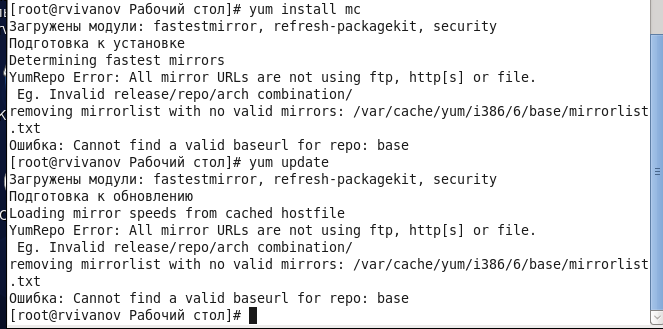{ #fig:030 width=70% }

4. Произвел определенные действия для того, чтобы другие виртуальные машины могли использовать машину Base и её конфигурацию как базовую (рис -@fig:031, рис -@fig:032).

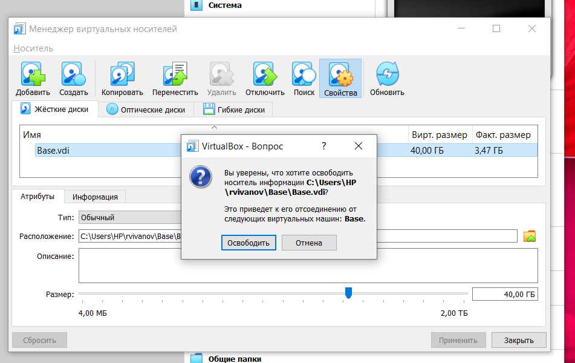{ #fig:031 width=70% }

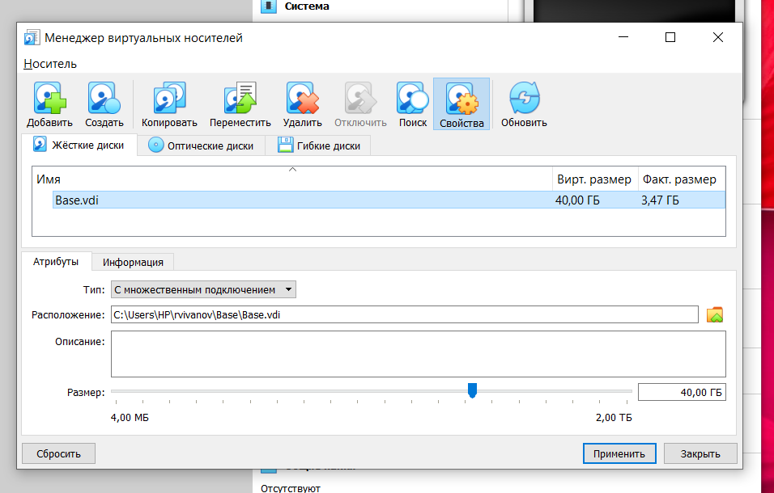{ #fig:032 width=70% }

На основе виртуальной машины Base создал машину Host2, выбрав при конфигурации виртуального жесткого диска «Использовать существующий жесткий диск»
Base.vdi (рис -@fig:033, рис -@fig:034).

{ #fig:033 width=70% }

{ #fig:034 width=70% }

# Выводы

Приобрел практические навыки установки операционной системы на виртуальную машину, настройки минимально необходимых для дальнейшей работы сервисов.
